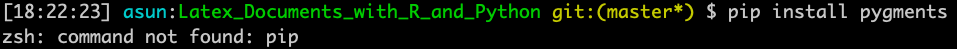

# Latex_Documents_with_R_and_Python
This project aims to combine in a LaTeX document standard text with chunks of code, particulary chunks of R code and Python code.

Any feedback is welcome, 😄 so please feel free to ask or comment anything you want. If you are shy 😳 and do not want to
write in the repo, I will be happy to answer you by email at asuncionjc@us.es 👩🏻‍💻 .

   

## Goals

The goal of this repo is to give the steps to write LaTeX documents which include chunks of R and Python code. These chunks of code can be executed or not according to the requirements.

## How it works?

To develop this project, the LaTeX package [pythontex](https://ctan.org/pkg/pythontex) will be used. This package has been developed by [Geoffrey Poore](https://github.com/gpoore). The link to its Github repository can be found [here](https://github.com/gpoore/pythontex).

## Previous requirements

To write documents using LaTeX and execute chunks of R and Python code, it is obviously necessary to have the tools to do it. Although the installation of LaTeX, R and Python exceeds the goals of this repo, I suggest you some references to download and install them. Particularly, [here](https://www.latex-tutorial.com/installation/) you can find how to install Latex. Regarding R, [this page](https://www.r-project.org/) is recommended for the programme and [this one](https://www.rstudio.com/) to get the well known IDE, RStudio. Finally, downloading the IDE Pycharm [here](https://www.jetbrains.com/pycharm/), you will get also a version of Python.

For more information about the programme versions, I recommend you to read [this link](https://github.com/gpoore/pythontex/blob/master/pythontex/pythontex.pdf).

### Install non-default Python packages

Some Python packages are required for using pythontex, namely `pygments`, `numpy`, `scipy`, `matplotlib` and `sympy`. In the next lines, I will explain how to do it in a MAC computer. The steps for the installation in Linux or Windows platforms will be given soon. 

The first thing we need to know is: Which Python packages do I have? To ask this question you have to open a terminal and follow these steps:

1) Call `python`.
2) Type `help('modules)`
3) Check the list of modules.

A screencast which shows the process can be seen below:
 

Once we know which packages are installed and which ones are missed, we need to proceed to the installation of some non-default packages. To this aim, you have to be sure that `pip` (a tool for installing Python packages is installed). Otherwise, you will get errors like this:

To install `pip` you just have to open a terminal and follow these steps:

1) Write `sudo easy_install pip`.
2) Type the password of your Mac.
3) Now, `pip` is installed.

If you have doubts, then have a look at this video:

## Installation

Developed By
------------

* Asunción Jiménez-Cordero - <asuncionjc@us.es>

License
-------

    Copyright 2019 Asunción Jiménez-Cordero

    Licensed under the Apache License, Version 2.0 (the "License");
    you may not use this file except in compliance with the License.
    You may obtain a copy of the License at

       http://www.apache.org/licenses/LICENSE-2.0

    Unless required by applicable law or agreed to in writing, software
    distributed under the License is distributed on an "AS IS" BASIS,
    WITHOUT WARRANTIES OR CONDITIONS OF ANY KIND, either express or implied.
    See the License for the specific language governing permissions and
    limitations under the License.